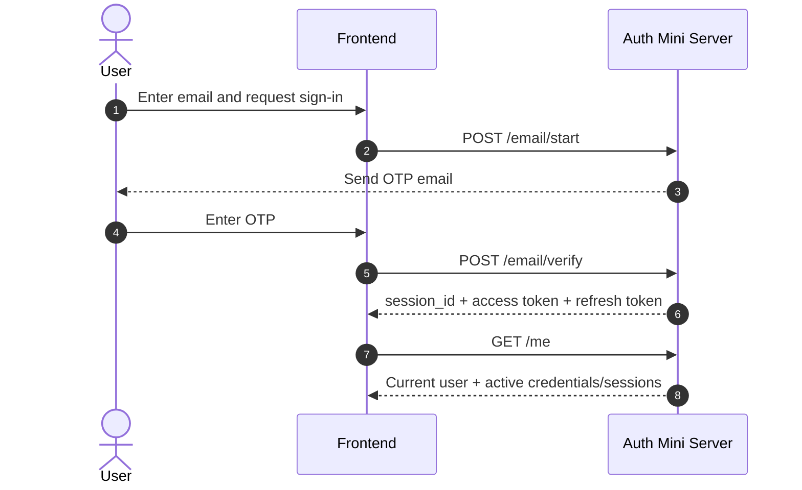
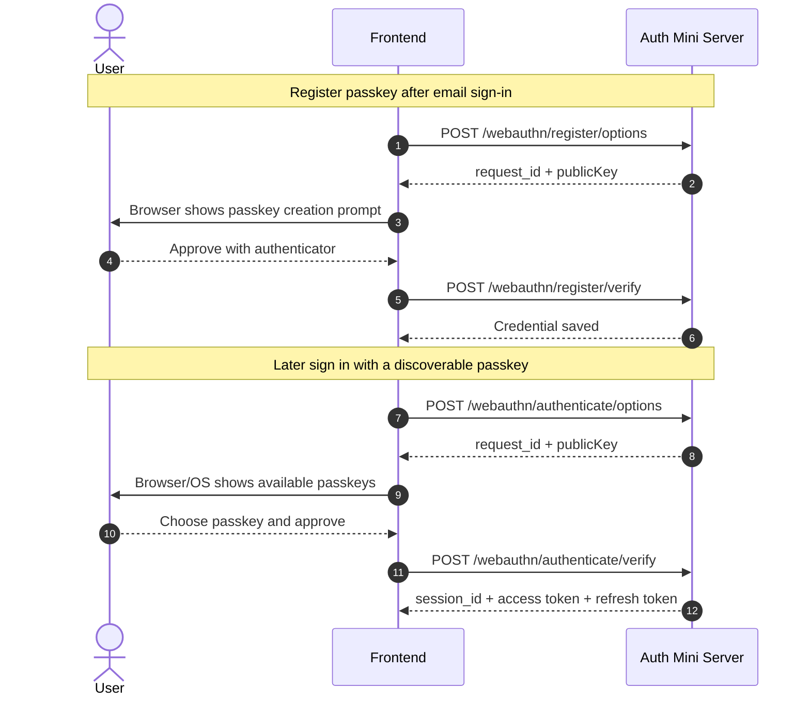
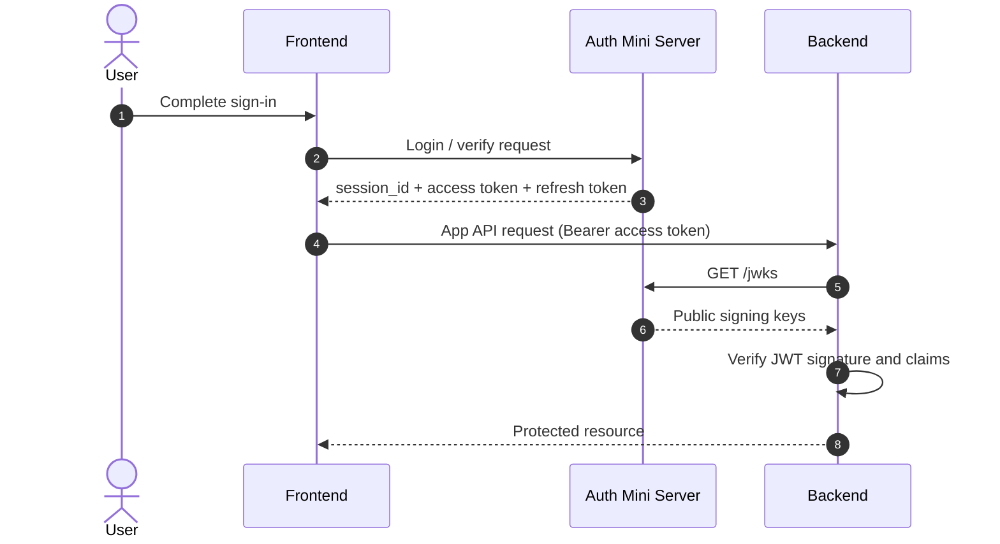

# auth-mini

Minimal, opinionated auth server for apps that just need auth.

auth-mini is for teams that want email sign-in, passkeys, JWTs, and a database they can actually understand without adopting a full backend platform just to get authentication working. It is intentionally small: email OTP for first login, discoverable passkeys for fast return sign-in, SQLite for storage, a small-footprint Hono HTTP server, and `/jwks` for backend token verification.

## Who this is for

- **For:** small products, internal tools, side projects, and teams that want to run a focused auth service themselves.
- **Not for:** teams looking for a hosted auth control plane, social login marketplace, user-management suite, or a broader backend platform.

The design shape exists because many apps need a reliable auth core, not an auth empire. auth-mini keeps the moving parts narrow enough to inspect, operate, and replace.

## Main user journeys

### Email OTP sign-in



### Passkey registration and sign-in



### Frontend -> backend -> `/jwks` verification



## Quick integration peek

Minimal CLI setup:

```bash
npx auth-mini init ./auth-mini.sqlite
```

Minimal browser SDK usage:

```html
<script src="https://auth.zccz14.com/sdk/singleton-iife.js"></script>
<script>
  window.AuthMini.session.onChange((state) => {
    console.log('auth status:', state.status);
  });
</script>
```

From there, typical integration looks like this:

- add your app origin with the CLI
- start auth-mini with your issuer
- configure SMTP, then sign in via email OTP and optionally register a passkey
- send the access token to your backend and verify it with `/jwks`

## Docs and next steps

`docs/` is the canonical static reference source. [`demo/`](demo/) is an interactive companion and playground, not the sole detailed docs surface.

- Browser SDK integration: [docs/integration/browser-sdk.md](docs/integration/browser-sdk.md)
- WebAuthn integration: [docs/integration/webauthn.md](docs/integration/webauthn.md)
- Backend JWT verification: [docs/integration/backend-jwt-verification.md](docs/integration/backend-jwt-verification.md)
- HTTP API reference: [docs/reference/http-api.md](docs/reference/http-api.md)
- CLI and operations: [docs/reference/cli-and-operations.md](docs/reference/cli-and-operations.md)
- Docker + Cloudflared deployment: [docs/deploy/docker-cloudflared.md](docs/deploy/docker-cloudflared.md)
- Interactive companion: [demo/](demo/)

For the one-container Cloudflare Tunnel path, see [docs/deploy/docker-cloudflared.md](docs/deploy/docker-cloudflared.md). Deployment details live there.

## Philosophy

### Why not a full auth platform?

If your project only needs authentication, a larger backend platform can be unnecessary overhead. auth-mini focuses on the auth slice so you can keep users, sessions, SMTP config, and signing keys understandable.

### Why email OTP + passkeys?

Email is familiar and useful for recovery and communication. Passkeys then provide phishing-resistant, username-less sign-in with discoverable credentials instead of another password system.

### Why SQLite?

Auth data is usually small, and operational simplicity matters. SQLite is easy to run, back up, inspect, and move without introducing another server just because auth sounds important.

### Why access + refresh tokens?

Access tokens stay short-lived and verifiable by APIs through `/jwks`; refresh tokens stay revocable and database-backed. That keeps backend verification simple without pretending leaked JWTs are easy to revoke.

## Development

Run `npm run format`, `npm run lint`, `npm run typecheck`, and `npm test`.

## License

MIT License
