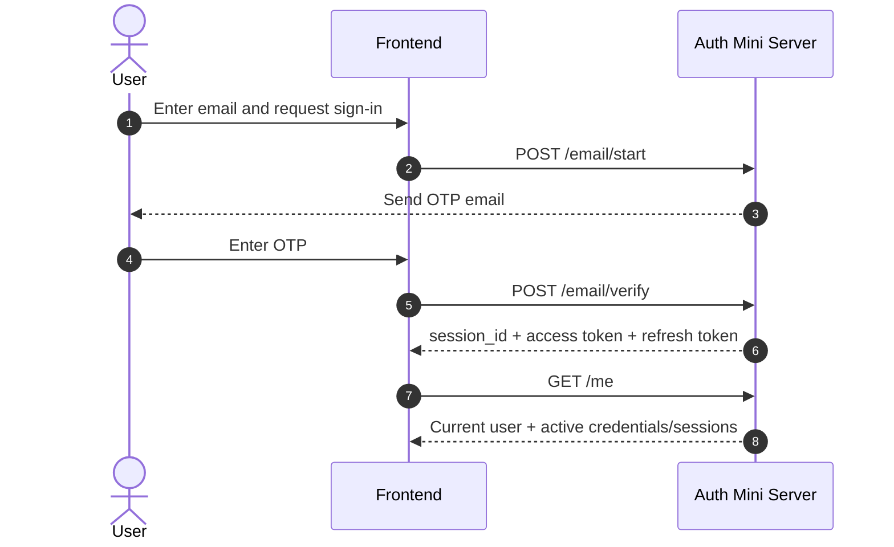
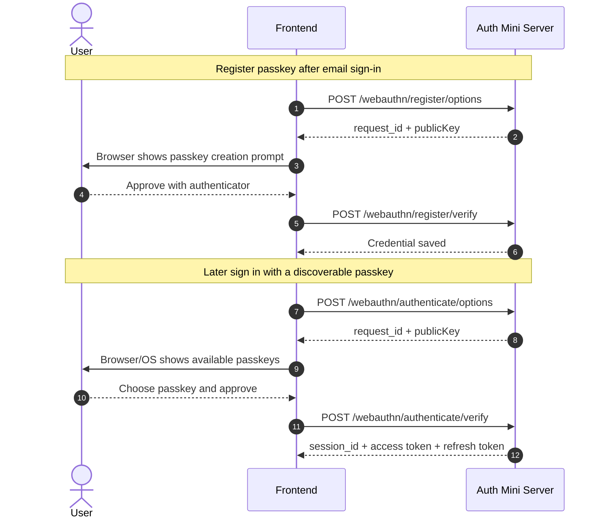
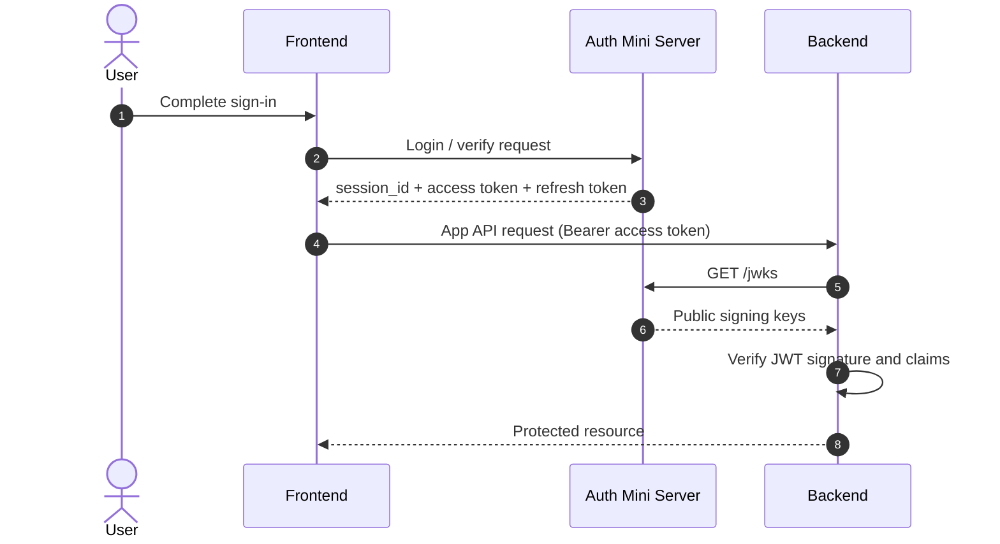

# auth-mini

> **Authentication** is a critical subsystem to prove who users are, while **Authorization** is another critical subsystem to control what users can do.

Minimal, opinionated authentication server for apps that just need a solid authentication core.

[Live demo](https://auth-mini.zccz14.com/#/setup?auth-origin=https%3A%2F%2Fauth.zccz14.com) | [Docs](docs/) | [GitHub](https://github.com/zccz14/auth-mini)

✅ Good fit for authentication system needs:

- 🔒 Password-less Authentication
  - 📧 Email One-Time Password (OTP) sign-in
  - 🔑 Passkey (WebAuthn) sign-in
  - 🔐 Ed25519 (EdDSA) sign-in for non-browser clients without WebAuthn support
- 🔄 Session Management
  - Issue JSON Web Token (JWT) access tokens for backend stateless verification
  - CURRENT/STANDBY JWKS key pairs for smooth key rotation
  - Issue opaque refresh tokens for long-term sessions and easy revocation while keeping JWTs short-lived
- You control the server and data. Not Google. Not AWS. Not Auth0. You.
  - Simple SQLite storage without extra Database servers (no Postgres, MySQL, Redis, etc. required)
  - CORS included for accessing from cross-origin front-ends.
- UUID-based user ID keeps it simple and opaque, and could be foreign keys for your app's user records if you want.

❌ Not trying to include: (But you can build these on top if you want!)

- Authorization features like ACLs, RBAC, ABAC, roles, permissions, groups, etc.
- Social Login like "Sign in with Google/Facebook/GitHub/etc."
- SMS or TOTP 2FA factors.
- User profiles like names, avatars, bios, etc.
- User management features like admin dashboards, user search etc.

## Main user journeys

### Email OTP sign-in



### Passkey registration and sign-in



### Device sign-in with Ed25519 keys

### Frontend -> backend -> `/jwks` verification



## Quick Start

Pre-requisites:

- Node.js 20.10.0+
- SMTP service credentials for email OTP. (Most email providers have SMTP options, or you can use transactional email services like SendGrid, Mailgun, etc.)

Minimal CLI setup:

```bash
npx auth-mini init ./auth-mini.sqlite
```

Setup SMTP config:

```bash
npx auth-mini smtp add ./auth-mini.sqlite  --from-email 'sample@your-domain.com' --from-name 'sample-name' --host 'smtp.sample.com' --port 465 --secure --username 'sample@your-domain.com' --password '<smtp-password>'
```

Setup Origin config:

```bash
npx auth-mini origin add ./auth-mini.sqlite --value 'https://frontend.your-domain.com'
```

No need to add backend API origins.

Start the server:

```bash
npx auth-mini start ./auth-mini.sqlite --port 7777 --issuer 'https://auth.your-domain.com'
```

Then deploy it with Cloudflare Tunnel or your preferred hosting method.

Minimal browser SDK usage:

```html
<script src="https://auth.your-domain.com/sdk/singleton-iife.js"></script>
<script>
  window.AuthMini.session.onChange((state) => {
    console.log('auth status:', state.status);
  });
</script>
```

Minimal backend JWT verification (jose example):

```js
import { createRemoteJWKSet, jwtVerify } from 'jose';

const issuer = 'https://auth.your-domain.com';
const JWKS = createRemoteJWKSet(new URL(`/jwks`, issuer));

async function verifyAccessToken(token) {
  try {
    const { payload } = await jwtVerify(token, JWKS, { issuer });
    console.log('Token is valid. Payload:', payload);
  } catch (err) {
    console.error('Invalid token:', err);
  }
}
```

From there, typical integration looks like this:

- add your app origin with the CLI
- start auth-mini with your issuer
- configure SMTP, then sign in via email OTP and optionally register a passkey
- send the access token to your backend and verify it with `/jwks`

## Docs and next steps

`docs/` is the canonical static reference source. `examples/demo/` is the current interactive demo source and Pages publish target, while the deployed live demo remains the easiest way to try the browser flows end-to-end.

- Browser SDK integration: [docs/integration/browser-sdk.md](docs/integration/browser-sdk.md)
- WebAuthn integration: [docs/integration/webauthn.md](docs/integration/webauthn.md)
- Backend JWT verification: [docs/integration/backend-jwt-verification.md](docs/integration/backend-jwt-verification.md)
- HTTP API reference: [docs/reference/http-api.md](docs/reference/http-api.md)
- CLI and operations: [docs/reference/cli-and-operations.md](docs/reference/cli-and-operations.md)
- Docker + Cloudflared deployment: [docs/deploy/docker-cloudflared.md](docs/deploy/docker-cloudflared.md)

For the one-container Cloudflare Tunnel path, see [docs/deploy/docker-cloudflared.md](docs/deploy/docker-cloudflared.md). Deployment details live there.

## Philosophy

### Why not a full auth platform?

If your project only needs authentication, a larger backend platform can be unnecessary overhead. auth-mini focuses on the auth slice so you can keep users, sessions, SMTP config, and signing keys understandable.

### Why email OTP + passkeys?

Email is familiar and useful for recovery and communication. Passkeys then provide phishing-resistant, username-less sign-in with discoverable credentials instead of another password system.

### Why SQLite?

Auth data is usually small, and operational simplicity matters. SQLite is easy to run, back up, inspect, and move without introducing another server just because auth sounds important.

### Why access + refresh tokens?

Access tokens stay short-lived and verifiable by APIs through `/jwks`; refresh tokens stay revocable and database-backed. That keeps backend verification simple without pretending leaked JWTs are easy to revoke.

## Development

Run `npm run format`, `npm run lint`, `npm run typecheck`, and `npm test`.

## License

MIT License
